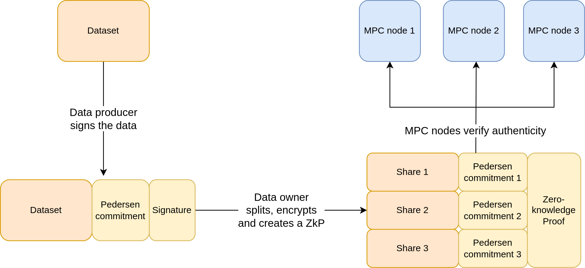

# ZKP component

The repository consists of the implementation of an application of Zero-Knowledge Proofs (ZKP) in the
KRAKEN marketplace.

## Authenticity of data in MPC system

#### Problem
The KRAKEN marketplace uses Multi-Party Computation (MPC) paradigm to process private data. This means that the data that
the platform processes is split in partial shares that are being processed in a decentralized way, not exposing it
to any of the processing nodes. One of the challenges of this approach is to add guarantees that the data is
authentic, since no computation node has access to the data in plaintext.

#### Solution
In the standard approach, data authenticity is guaranteed by adding a cryptographic signature by the
data producer, that is checked by the data consumers. Since this is not possible in the MPC scenario, since the
nodes do not have access to the data in plaintext, we built the authenticity guarantee on ZK-Proofs. Instead,
ZK-Proofs are attached to shares of data, proving to the MPC nodes that the share they received, together to the
commits of the shares that other MPC nodes received, does indeed match the data that was signed by the data
owners. See the bellow figure for the details.

[//]: # (![]&#40;.github/figures/zkp_flow.png&#41;)

<p align="center">
  
</p>

## Running the code
The code was directly integrated in the KRAKEN marketplace. Please see `zkp_splits_csv_test.go` file for
the complete data flow in the ZKP scenario. To run the test simply run in the main repository
```console
go test -v .
```